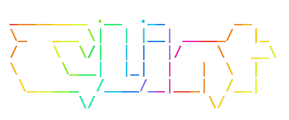

---
prev:
  text: 'Components'
  link: '/frontend/components/components'
---

# Introduction to Clint

Clint is our internal frontend updater and tester tool built with TypeScript and Node.js. It serves two primary purposes:

1. **Automated Updates**: Keep your frontend codebase up-to-date with the latest components, utilities, and best practices from our base repository
2. **Site Testing**: Run comprehensive accessibility, HTML validation, CO², and link checking tests on your websites

## What Can Clint Do?

### Updater Features

- **Smart Version Detection**: Automatically checks for updates to both CLI and frontend packages
- **Selective Updates**: Choose to update CLI tools, frontend components, or both
- **Git Integration**: Seamlessly integrates with Git to pull updates from the base repository
- **Safe Synchronization**: Updates specific files while preserving your project-specific customizations
- **Find & Replace**: Apply automated code transformations across your templates
- **Visual Comparison**: Take and compare screenshots to detect visual regressions

### Testing Features

- **Accessibility Testing**: Uses pa11y with both Axe and HTML_CodeSniffer runners to detect WCAG violations
- **HTML Validation**: Validates HTML markup against standards to catch errors early
- **Link Checking**: Identifies broken internal and external links
- **Heading Structure Analysis**: Validates proper heading hierarchy (h1, h2, h3, etc.)
- **CO2 Footprint**: Measures the carbon footprint of your web pages
- **Multiple Output Formats**: View results in the terminal or as an interactive HTML report

## How It Works

When you run Clint, you'll be presented with an interactive CLI that lets you:

1. **Check for Updates**: See if new versions of the CLI or frontend packages are available
2. **Apply Updates**: Selectively update your codebase with the latest changes
3. **Run Tests**: Execute comprehensive tests on your website

Clint is configured through the `cli.config.json` file in the `/clint` directory, which specifies:

- Package paths and Git repository URLs
- Update paths and sync settings
- Files and directories to exclude from synchronization

## Why Use Clint?

- **Consistency**: Keep all projects aligned with the latest frontend standards
- **Quality Assurance**: Catch accessibility and HTML issues before they reach production
- **Time Saving**: Automate repetitive update and testing tasks
- **Developer Friendly**: Interactive CLI with clear prompts and colored output

## Next Steps

Ready to get started? Check out these guides:

- **[Getting Started](/frontend/clint/getting-started)** - Installation, setup, and your first test
- [Testing Capabilities](/frontend/clint/tests) - Overview of all available tests
- [Configuration](/frontend/clint/configuration) - How to configure Clint for your project
- [Update Process](/frontend/clint/updates) - Understanding how updates work

::: tip
Clint is designed to be a developer helper tool. Some technical knowledge is required to configure and use it effectively.
:::
